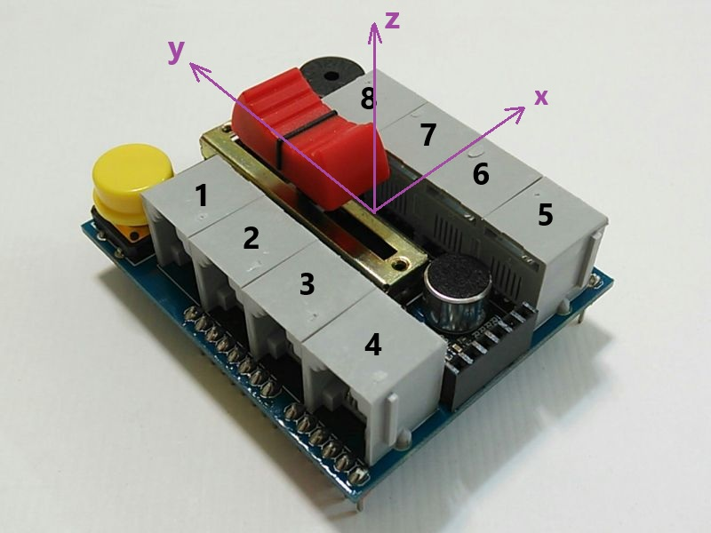

# funXblock 1.84z for funXbot and funXdrone

# 安裝方法
1. 下載 Kittenblock 1.8.4 ( -> https://reurl.cc/O5zqKy )後安裝
2. 於此處(GitHub)下載 xblock1.84z
3. 解壓縮後將所有檔案拷貝至 :\Program Files (x86)\Kittenblock 資料夾內

TODO: a batch file to do xcopy automatically 

# funXbot v1 使用注意事項
1. 接口1A不能和主機內建 光強度感應器 同時使用
2. 接口1B不能和主機內建 滑動式可變電阻(紅嘴) 同時使用
3. 接口2B不能和主機內建 聲強度感應器 同時使用
4. 程式積木所指x軸為朝接口5-8方向; y軸朝向USB及電源接口方向

5. 安插 funXtcp WiFi 模組時, 白色標記需和主控器無線通訊接口白色標記對齊(插反會燒毀)
6. 無線通訊接口無法和有線通訊接口(USB) 同時使用. 使用USB前, 請先拔除funXtcp WiFi 模組
7. 使用無線通訊前, 需先在Windows 連無線網路(預設密碼12345678), 再在funXblock中連 funXbot