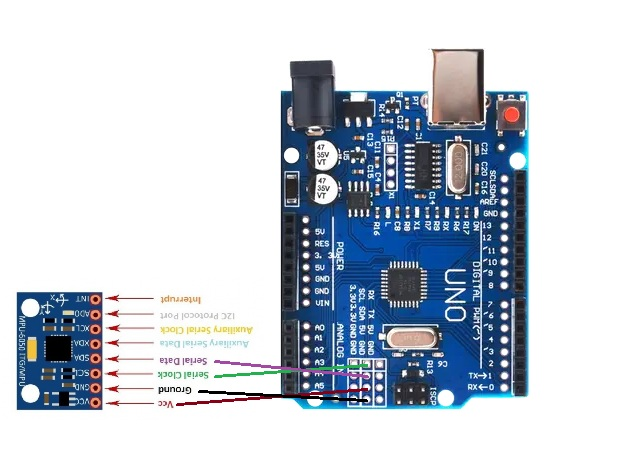
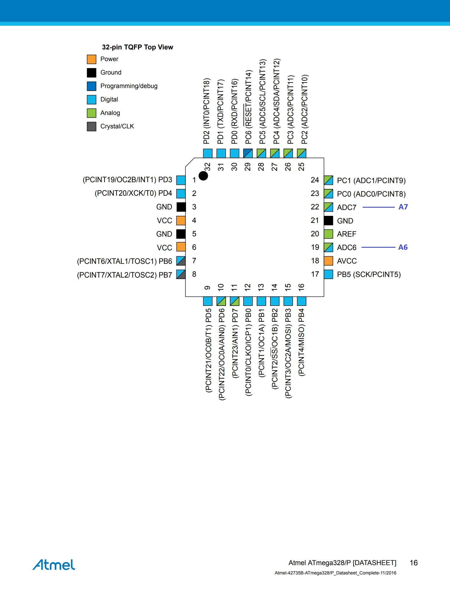
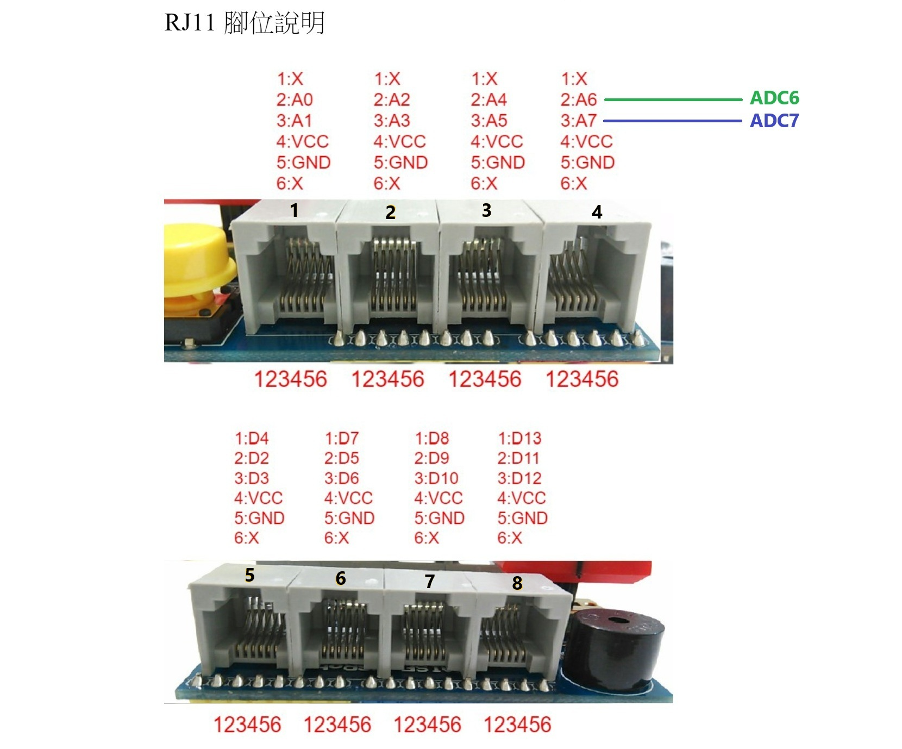
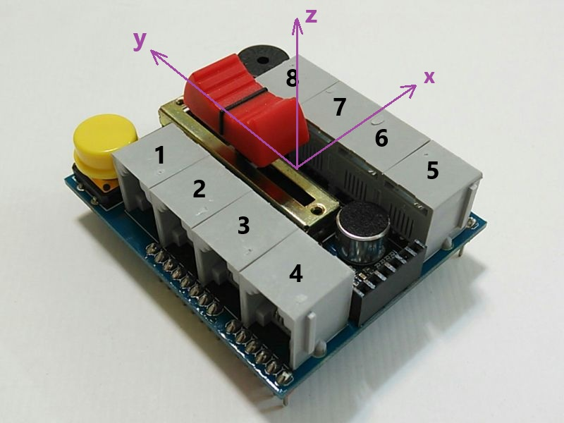
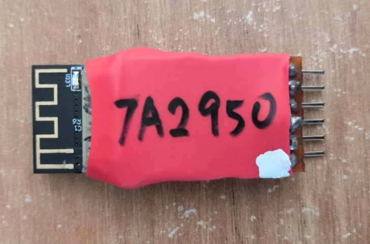
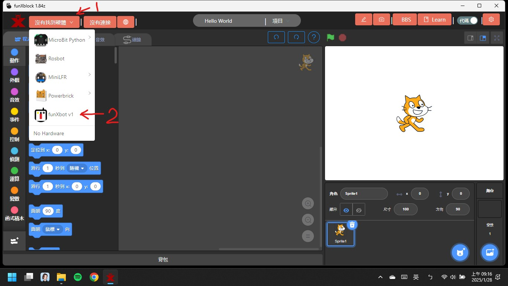
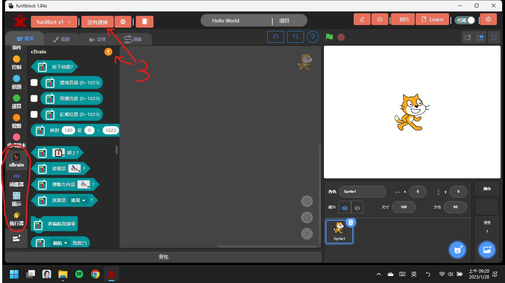
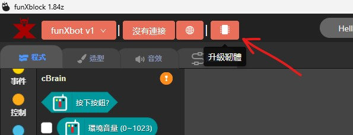
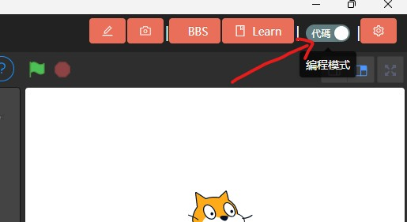
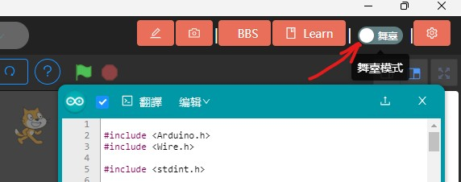

  <picture>
    <source media="(prefers-color-scheme: dark)" srcset="funxedu-logo4-white.png">
    <source media="(prefers-color-scheme: light)" srcset="funxedu-logo4-black.png">
    
  </picture>
   

funXbot v1 是一個低成本、DIY（自己動手做）的機器人套件項目，專為教育用途設計。

!! 此專案授權僅限個人或學校教學非商業用途。嚴禁任何商業使用、分發或用於商業目的之修改 !!

# 項目包含硬件和軟件兩大部分
* `funXbot v1`: 主機、電池盒、感應器、顯示設備和馬達等設備，搭配樂高規格相容積木所組成的完整教育機器人套件
* `funXblock`: 基於 `Kittenblock` 積木編程軟體 (基於 `Scratch`，但增加了上傳程式讓機器人離線自主動作的功能)，是 funXbot v1 的程式開發環境(IDE)，目前僅有 Windows 版

# DIY 材料清單
* 主機:
    * 32-pin TQFP 封裝的 Arduino UNO R3 開發板
    * MPU6050 加速度計和陀螺儀模組 (I2C接口)
    * 凱斯電子 KSB030 S4A 擴充板
    * Arduino UNO 樂高積木外殼 或 一般外殼

* 電池盒: 可裝2顆14500鋰電池串聯(8.4V)，需附開關，插頭為圓頭 DC 5.5x2.1mm

* funXtcp WiFi模組:
  * ESP12S 模組
  * 洞洞板 + 排針
  * 10KΩ 以上 + 2倍阻值 電阻

* 感應器:
    * 數位感應器模組，例如：紅外線避障、
    * 類比感應器模組
    * HC-SR04 超聲波距離感應器模組
    * DHT11 溫濕度感應器模組
    * TCS34725 RGB顏色感應器模組 (I2C接口)
    * PCF8574 類比IO擴展模組 (I2C接口)
    * QTR-8A 循線模組
    * QMC5883L 磁力計 (I2C接口)
    * 碼盤計數模組

* 顯示設備:
  * TM1637 數字顯示模組
  * MAX7219 8x8 LED顯示模組
  * WS2812B 5050 RGB LED燈條或燈環

* 馬達:
  * SG90 或 MG90 伺服馬達
  * SG90 或 MG90 360度連續旋轉馬達
  * MX1508 直流馬達驅動板
  * USB MicroB 或 TypeC 公 及 母 PCB板
  * TT 直流有刷馬達 或 樂高馬達

* 線材:  
  * 匹配UNO開發板 USB 接口型式的 USB `數據線`
  * RJ11 4線 和 6線 水晶頭
  * 電話 或 網路線
  * 杜邦線

* 樂高規格積木

## 所需工具
* `3D列印機`: 用於製作樂高相容外殼
* `焊接工具`: 用於電路接線
* `熱熔膠槍`: 用於固定電路板和絕緣
* `PVC膠水`: 用於黏接積木和外殼
* `Windows電腦`: 用於 `funXblock` 安裝

# funXbot v1 組裝方法
* `主機`
1. mpu6050 模組 x軸朝向左, y軸朝向後, z軸朝上 固定於開發板上, 依圖接線

2. 將32-pin TQFP封裝的 ATmega328/P ADC6, ADC7 接到 擴充板的RJ11 A6, A7  

3. 將擴充板的無線通訊接口(BT1) VG1相對應的電阻移除 

4. 將擴充板的無線通訊接口(BT1)的VG1腳位接3.3V (funXtcp WiFi模組用)

5. 將無線通訊接口(BT1) pin6(VG2旁空腳位) 接 UNO板 RESET 腳位

6. 將擴充板插入UNO插座後放入Arduino UNO 樂高積木外殼 或 一般外殼中

7. 如果採用一般外殼, 需要在外殼周圍和底部用PVC膠黏接積木, 確保積木不會掉落

* `電池盒`: 底部用PVC膠黏接積木, 確保積木不會掉落

* `funXtcp WiFi模組`:

# funXblock安裝方法
1. 下載 Kittenblock 1.8.4 ( -> https://reurl.cc/O5zqKy )後安裝
2. 於此處( https://github.com/robot4fun/xblock1.84z )下載 xblock1.84z 後解壓縮

3. 以 "管理員權限" 執行 install.bat

# funXbot v1 使用注意事項
1. 接口1A不能和主機內建 光強度感應器 同時使用
2. 接口1B不能和主機內建 滑動式可變電阻(紅嘴) 同時使用
3. 接口2B不能和主機內建 聲強度感應器 同時使用
4. 程式積木所指x軸為朝接口5-8方向; y軸朝向USB及電源接口方向

5. 安插 funXtcp WiFi 模組時, 白色標記需和主控器無線通訊接口白色標記對齊

6. 無線通訊接口無法和有線通訊接口(USB) 同時使用. 使用USB前, 請先拔除funXtcp WiFi 模組
7. 使用無線通訊前, 需先在Windows 連無線網路(SSID: funXtcp_00xx, 預設密碼12345678), 再在funXblock中連 funXbot
8. 可使用USB或電池盒供電. 電池盒需要2顆 14500 鋰電池串聯(8.4V), 請勿使用電壓不足的電池, 例如鹼性或鎳氫電池

# 如何在 funXblock 中使用 funXbot v1
1. 在硬體選單中點選 "funXbot v1"

2. 點選 "連接" 按鈕或圖示即可連接 funXbot

3. 預設為 "舞台模式" (on-line), 可和電腦連線互動. 如果無法互動, 請點選 "升級韌體"

4. 如果要讓 funXbot 獨立運作, 請點選 "編程模式" (off-line)

5. 點選 "編程模式" 後, 會出現C++ 編程視窗, 這裡會自動翻譯積木程式為C++語言. 程式完成後點選 "上傳" 即可上傳到 funXbot 中

6. 點選 "舞台模式" 即可回到舞台

7. 一旦 "編程模式" (off-line)下曾經上傳過程式, 要再回到 "舞台模式" 和電腦連線互動, 就必須再點選 "升級韌體"後才可以
