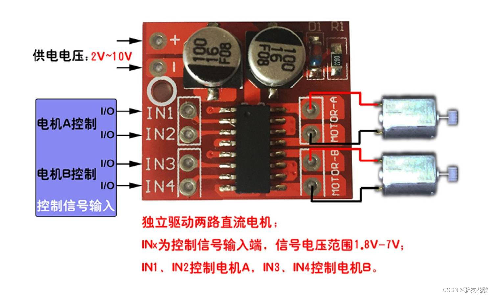

  <picture>
    <source media="(prefers-color-scheme: dark)" srcset="funxedu-logo4-white.png">
    <source media="(prefers-color-scheme: light)" srcset="funxedu-logo4-black.png">
    
  </picture>
   

funXbot v1 是一個低成本、DIY（自己動手做）的機器人套件項目，專為教育用途設計。

!! 此專案授權僅限個人或學校教學非商業用途。嚴禁任何商業使用、分發或用於商業目的之修改 !!

# 項目包含硬件和軟件兩大部分
* `funXbot v1`: 主機、電池盒、感應器、顯示設備和馬達等設備，搭配樂高規格相容積木所組成的完整教育機器人套件
* `funXblock`: 基於 `Kittenblock` 積木編程軟體 (基於 `Scratch`，但增加了上傳程式讓機器人離線自主動作的功能)，是 `funXbot v1` 的程式開發環境(IDE)，目前僅有 Windows 版

# funXbot v1 套件可以怎麼玩?

# DIY 材料清單
* 主機:
    * 32-pin TQFP 封裝的 Arduino UNO R3 開發板
    * MPU6050 加速度計和陀螺儀模組 (I2C接口)
    * 凱斯電子 KSB030 S4A 擴充板
    * Arduino UNO 樂高積木外殼 或 一般外殼

* 電池盒: 可裝2顆14500鋰電池串聯(8.4V)，需附開關，插頭為圓頭 DC 5.5x2.1mm

* funXtcp WiFi模組:
  * ESP12S 模組
  * 洞洞板 + 排針
  * 10KΩ 以上 + 2倍阻值 電阻

* 感應器:
    * 數位感應器模組，例如：紅外線避障、按鈕等
    * 類比感應器模組，例如：紅外線測距
    * HC-SR04 超聲波距離感應器模組
    * DHT11 溫濕度感應器模組
    * TCS34725 RGB顏色感應器模組 (I2C接口)
    * CD74HC4067 類比IO擴展模組
    * QTR-8A 循線模組
    * QMC5883L 磁力計 (I2C接口)
    * 碼盤計數模組

* 顯示設備:
  * TM1637 數字顯示模組
  * MAX7219 8x8 LED顯示模組
  * WS2812B 5050 RGB LED燈條或燈環

* 馬達:
  * SG90 或 MG90 伺服馬達
  * SG90 或 MG90 360度連續旋轉馬達(當一般馬達用)
  * MX1508 直流馬達驅動板
  * USB MicroB 或 TypeC 公 及 母 PCB板
  * TT 直流有刷馬達 或 樂高馬達

* 線材:  
  * 匹配UNO開發板 USB 接口型式的 USB `數據線`
  * RJ11 4線 和 6線 水晶頭
  * 電話 或 網路線
  * 杜邦線
  * 熱縮套管

* 樂高規格積木

## 所需工具
* `3D列印機`: 用於製作樂高相容外殼
* `焊接工具`: 用於電路接線
* `熱風槍`: 熱縮套管用
* `燒錄器`: 用於燒錄程式到 ESP12S 模組中
* `熱熔膠槍`: 用於固定電路板和絕緣
* `PVC膠水`: 用於黏接積木和外殼
* `Windows電腦`: 用於安裝 `funXblock`
* `14500鋰電池充電器`

# funXbot v1 製作方法
* `主機`
  1. 依圖連接 MPU6050 模組和 UNO 開發板後，將 MPU6050 模組依圖示方向 ( x軸朝向左, y軸朝向後, z軸朝上 ) 固定於開發板上 

  2. 將32-pin TQFP封裝的 ATmega328/P ADC6, ADC7 接到 擴充板的RJ11 A6, A7  

  3. 依照片將擴充板的RJ11接口寫上編號，方便之後連接線材
  
  4. 將擴充板的無線通訊接口(BT1) VG1相對應的電阻移除 

  5. 將擴充板的無線通訊接口(BT1)的VG1腳位接3.3V (funXtcp WiFi模組用)

  6. 將無線通訊接口(BT1) pin6(VG2旁空腳位) 做記號後接 UNO板 RESET 腳位

  7. 將擴充板插入UNO插座後放入Arduino UNO 樂高積木外殼 或 一般外殼中

  8. 如果採用一般外殼，需要在外殼周圍和底部用PVC膠黏接積木，確保積木不會掉落

* `電池盒`: 底部用PVC膠黏接積木，確保積木不會掉落

* `funXtcp WiFi模組`:
  * 下載 [`wifi/`](/wifi) 目錄內所有韌體檔案 ( *.bin ) 到電腦

  * 將ESP12S模組正確放在 `燒錄器` 上  (如果使用 `USB to TTL` 或 `開發板` 當燒錄器，請確保接線和電壓正確)

  * 以 `USB 訊號線` (不是充電線) 連接 `電腦` 和 `燒錄器` 

  * 點選進入 [`燒錄工具網頁版`](https://espressif.github.io/esptool-js/)

  * 點選網頁 `Connect` 按鈕，選擇正確的`USB端口` 後點選 `連線`
  
  * `Flash Address` 設為 `0x0` ，點選 `選擇檔案` 按鈕後選擇之前下載的韌體檔 [boot_v1.7.bin](wifi/boot_v1.7.bin)

  * 點選 `Add File` 按鈕後會增加一列，依下表依序增加韌體檔

    | Flash Address | File |
    | :-----------: | :-----: |
    | 0x0000 | [boot_v1.7.bin](wifi/boot_v1.7.bin) |
    | 0x1000 | [user1.bin](wifi/user1.bin) |
    | 0x3FC000 | [esp_init_data_default_v08.bin](wifi/esp_init_data_default_v08.bin) |
    | 0x3FE000 | [blank.bin](wifi/blank.bin) |
  
  * 點選網頁 `Program` 按鈕後開始燒錄韌體
  * 燒錄完成後點選網頁 `Disconnect` 按鈕

  * 按壓ㄧ下燒錄器的 `復位` 按鈕，讓ESP12S模組重新啟動
  
  * 筆電WiFi連接 ESP12S模組 ( 預設SSID: `ESP_00xx` ) 後
    * 以瀏覽器連192.168.4.1 
    * 進入網頁後選 `更新韌體` 
    * 選取 [user2.bin](wifi/user2.bin)
    * reload網頁後將 `serial LED` 改為 `GPIO2` 
    * 視情況更改 `Reset` 腳位，應該是 `GPIO13` 
    * 更新韌體回 [user1.bin](wifi/user1.bin) 
    * 更改 `Hostname` 為 `funXbot`
    * 更改 `AP 名稱` 為 `funXtcp00xx`
    * 更改 `AP 密碼` 為 `12345678`

  * 拔除 `USB 數據線` 後取下 `ESP12S模組`
  * 依圖自行焊接  之後在 `IO13` 針腳做標記 
  * 用熱縮套管包覆焊接處，確保不會短路

## 製作其他設備
* RJ11 `4線` 水晶頭 (電話線) 會連接母座的 `2-5腳位`，RJ11 `6線` 水晶頭 (網路線) 會連接母座的 `1-6腳位` 
* 除電源和接地外，請按以下說明接線:
* 1個水晶頭分支接多設備情況下，`腳位1` 設備標記 `C`，`腳位2` 設備標記 `B`，`腳位3` 設備標記 `A`

* `感應器`: 
  * 類比、數位、DHT11溫溼度 等感應器訊號接 `腳位3` 
  * 超音波感應器 `trig` 訊號接 `腳位2`， `echo` 訊號接 `腳位3`
  * I2C類感應器 `SDA` 訊號接 `腳位2`， `SCL` 訊號接 `腳位3`

  * 循線感應器由 `QTR-8A 循線模組` 和 `CD74HC4067 類比IO擴展模組` 組成   將兩者的對應腳位連接後，使用 `6線` 水晶頭將 CD74HC4067 類比IO擴展模組的 `s0` 接 `腳位1`， `s1` 接 `腳位2`， `s2` 接 `腳位3`， `SIG` 需額外的 `4線` 水晶頭，接 `腳位3` 。

* `顯示設備`:
  * TM1637數字顯示板的 `clk` 接 `腳位2` ， `dio` 接 `腳位3`
  * 燈條或燈環訊號接 `腳位3`
  * 將兩個 MAX7219 LED 顯示板拼接後，使用 `6線` 水晶頭， `clk` 接 `腳位1` ， `cs` 接 `腳位2` ， `din` 接 `腳位3`

* `馬達`:
  * 伺服馬達接 `腳位3`
  * 360連續旋轉伺服馬達接 `腳位2`  
  * 直流馬達需接入 `MX1508 直流馬達驅動板`  1張可驅動2台馬達，因為便宜，每張驅動1台馬達就好。將其黏接在TT馬達上，依圖說接線， `IN1` 接 `腳位2` ， `IN2` 接 `腳位3` 
  * 如果要同時驅動2台直流馬達，須將MX1508驅動板的 `MOTOR` 接 USB `MicroB` 或 `TypeC` 母座，馬達接USB公頭，較為方便
  * 如果要增加馬達功率，可將MX1508驅動板的電源接電池側(可增加電池保護板)，但驅動電流最大也僅2A

* 設備接好線後，可用熱熔膠黏接積木當底座，或3D打印製作外殼( [ `3d/`](3d/) 目錄內有一些設計 )

# funXblock安裝方法
1. 下載 [Kittenblock 1.8.4](https://reurl.cc/O5zqKy) 後安裝

2. 於此處下載 `funXblock` 後解壓縮 

3. 以 "管理員權限" 執行 `install.bat`

# funXbot v1 使用注意事項
1. 接口1A不能和主機內建 光強度感應器 同時使用

2. 接口1B不能和主機內建 滑動式可變電阻(紅嘴) 同時使用

3. 接口2B不能和主機內建 聲強度感應器 同時使用

4. funXblock程式積木所指x軸為朝接口5-8方向; y軸朝向USB及電源接口方向

5. 安插 funXtcp WiFi 模組時, 白色標記需和主控器無線通訊接口白色標記對齊

6. 無線通訊接口無法和有線通訊接口(USB) 同時使用. 使用USB前, 請先拔除funXtcp WiFi 模組

7. 使用無線通訊前, 需先在Windows 連無線網路(SSID: funXtcp00xx, 預設密碼12345678), 再在funXblock中連 funXbot

8. 可使用USB或電池盒供電. 電池盒需要2顆 14500 鋰電池串聯(8.4V), 請勿使用電壓不足的電池, 例如鹼性或鎳氫電池

# 如何在 funXblock 中使用 funXbot v1
1. 在硬體選單中點選 `funXbot v1`

2. 點選 `連接` 按鈕或圖示後選擇正確的WiFi或USB埠即可連接 funXbot

3. 預設為 `舞台模式` (on-line), 可和電腦連線互動. 如果無法互動, 請點選 `升級韌體`

4. 如果要讓 funXbot 獨立運作, 請點選 `編程模式` (off-line)

5. 點選 `編程模式` 後, 會出現C++ 編程視窗, 這裡會自動翻譯積木語言為C++語言. 程式完成後點選 `上傳` 即可上傳到 funXbot 中 

6. 點選 `舞台模式` 即可回到舞台

7. 一旦 `編程模式` (off-line)下曾經上傳過程式, 要再回到 `舞台模式` 和電腦連線互動, 就必須再點選 `升級韌體` 後才可以
